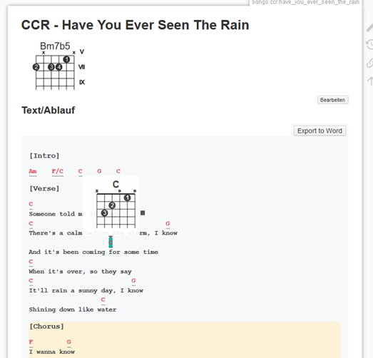

# chordsheets Plugin for DokuWiki

Pretty and interactive chord sheets like on ultimate guitar for dokuwiki

All documentation for this plugin can be found at
https://github.com/apazureck/dokuwiki-chordsheets

If you install this plugin manually, make sure it is installed in
lib/plugins/chordsheets/ - if the folder is called different it
will not work!

Please refer to http://www.dokuwiki.org/plugins for additional info
on how to install plugins in DokuWiki.

## Usage

To get a chord sheet, just put your sheet (for example from ultimate guitar) in the chordsheet tags:

```xml
<chordSheet 0>
[Intro]
Am    F/C    C    G    C      

[Verse]
C
Someone told me long ago
C                                   G
There's a calm before the storm, I know
                     C
And it's been coming for some time
C
When it's over, so they say
C                          G
It'll rain a sunny day, I know
                   C  
Shining down like water
...
</chordSheet>
```

The number indicates transposition in half-tones (negative numbers is down).

Single chords can be displayed using the syntax of [JTab JS](http://jtab.tardate.com/). The rendered `Bm7b5` chord seen below is rendered by using this input: `%7/2.X/X.7/3.7/4.6/1.X/X[Bm7b5]`.

