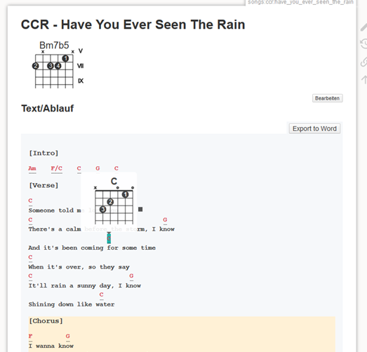

# chordsheets Plugin for DokuWiki


Pretty and interactive chord sheets like on ultimate guitar for dokuwiki

All documentation for this plugin can be found at
https://github.com/apazureck/dokuwiki-chordsheets

If you install this plugin manually, make sure it is installed in
lib/plugins/chordsheets/ - if the folder is called different it
will not work!

Please refer to http://www.dokuwiki.org/plugins for additional info
on how to install plugins in DokuWiki.

## Usage

To get a chord sheet, just put your sheet (for example from ultimate guitar) in the chordsheet tags:

```xml
<chordSheet 0>
[Intro]
Am    F/C    C    G    C      

[Verse]
C
Someone told me long ago
C                                   G
There's a calm before the storm, I know
                     C
And it's been coming for some time
C
When it's over, so they say
C                          G
It'll rain a sunny day, I know
                   C  
Shining down like water
...
</chordSheet>
```

The number indicates transposition in half-tones (negative numbers is down).

Single chords can be displayed using the syntax of [JTab JS](http://jtab.tardate.com/). The rendered `Bm7b5` chord seen below is rendered by using this input: `%7/2.X/X.7/3.7/4.6/1.X/X[Bm7b5]`.



## Metadata and instruments

Structured printable metadata is declared on the opening tag:

```xml
<chordSheet 0 title="Wild Song" author="Ada Example" date="2026-07-30">
...
</chordSheet>
```

The optional `instrument="ukulele"` attribute selects four-string GCEA
diagrams; guitar remains the default. Unknown instruments and invalid dates
fall back safely, and metadata values are rendered as text.

The original `<chordSheet 0>` form remains supported unchanged. The number is
the transposition in semitones; all attributes are optional. Rendered sheets
expose validated state through `data-transpose`, `data-instrument`,
`data-tooltips`, `data-tooltip-behavior`, `data-section-style`,
and `data-export-metadata` for themes and export tools.

Add `source="tabs"` to an opening tag when an example should let readers
switch between the rendered **Ansicht** and its copyable DokuWiki **Source**.
This is opt-in, so existing chord sheets keep their current output without
additional controls.

## Inline chords, tablature, and notation

Slash chords such as `G/B` also expose the bass through `data-bass-note` and
the `.song-bass-note` element, so themes and exporters can process it
independently.

Use `[C]` for an inline chord in a lyric line; `(G/B)` is also supported.
A section such as `[Verse]` is recognized only when it occupies the whole
line. Escape literal delimiters as `\[C\]` or `\(G\)`, and write `\\` for a
literal backslash.

### Pinning a guitar voicing

Add an explicit six-string shape after a chord when its exact guitar voicing is
part of the song:

```text
C@{x,3,2,0,1,0}   G/B@{x,2,0,0,0,3}
Play [Am7@{x,0,2,0,1,0}] softly
```

Strings are written from low E to high e. Use `x` for a muted string, `0`
for an open string, or a fret from `1` through `24`. An optional finger can
follow a fret, for example `F@{1/1,3/3,3/4,2/2,1/1,1/1}`.

The source shape is marked **Pin** together with its fret position and is the
initial diagram. The visual picker labels alternatives as **Open** or by their
lowest played fret. Use **Fretboard** and **Tab** to switch the same selected
shape between a grip diagram and six-string tablature. These temporary comparisons do not alter the
wiki source. Transposition moves the complete fret shape chromatically; finger
numbers are omitted after transposition because open strings and barre
fingerings may change. Clean Word export keeps the chord name but omits both the
source annotation and interactive diagram.

JTab-compatible guitar tablature uses a dedicated block:

```text
{{tab}}
$2 0 1 3 $1 0 3 | 022100
{{/tab}}
```

Standard notation uses pinned, locally bundled abcjs and ABC notation:

```text
{{notation}}
X:1
M:4/4
L:1/4
K:C
C D E F | G A B c |
{{/notation}}
```

The supported ABC subset includes notes, rests, measures, clefs, key
signatures, and time signatures. Invalid blocks show a local error and do not
break surrounding lyrics. JTab remains LGPL-2.1-or-later; abcjs is MIT
licensed, with notices in `licenses/`.

## Configuration and document export

Administrators can use DokuWiki's Configuration Manager to set chord and lyric
colors, fonts, independent chord and lyric sizes, spacing, section styling,
tooltip behavior, metadata export, and the Word export font family. Invalid
values are normalized safely. Themes can override `--cs-chord-color`,
`--cs-lyric-color`, `--cs-font-family`, `--cs-lyrics-font-size`,
`--cs-chords-font-size`, `--cs-line-spacing`, `--cs-section-color`,
`--cs-section-background`, and `--cs-export-font-family` on
`.song-with-chords`. Inline values generated from admin settings take
precedence.

Use **Copy for Word** to transfer the clean song, optional metadata, tablature,
and notation into a document without interactive tooltip controls.
